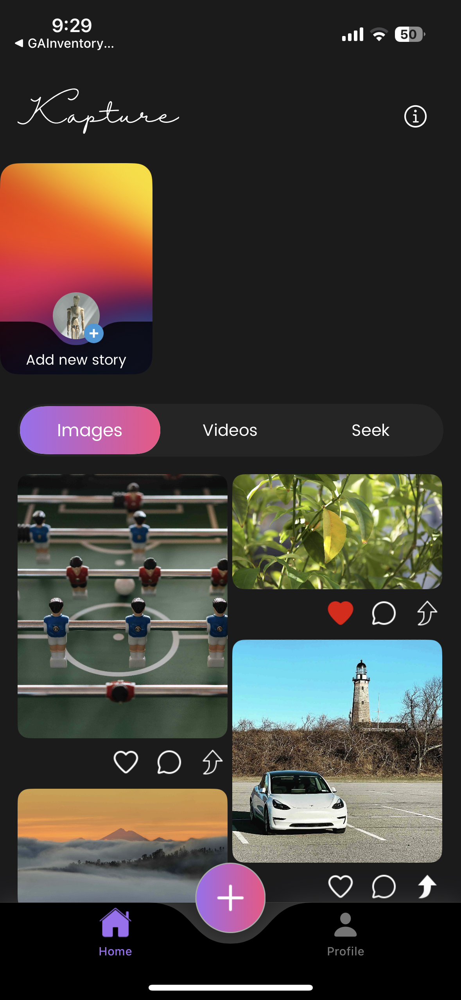
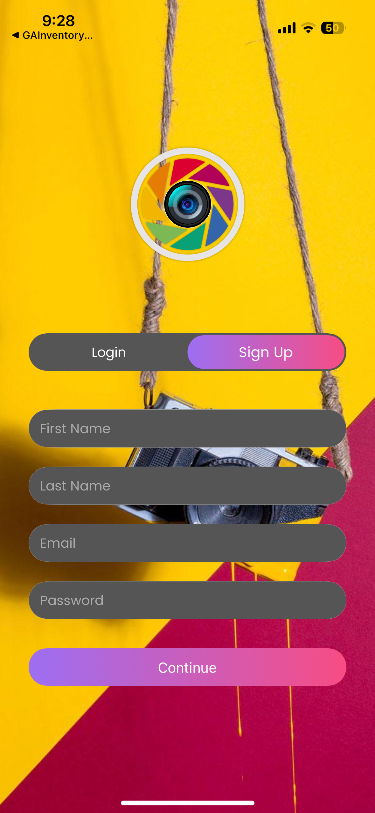
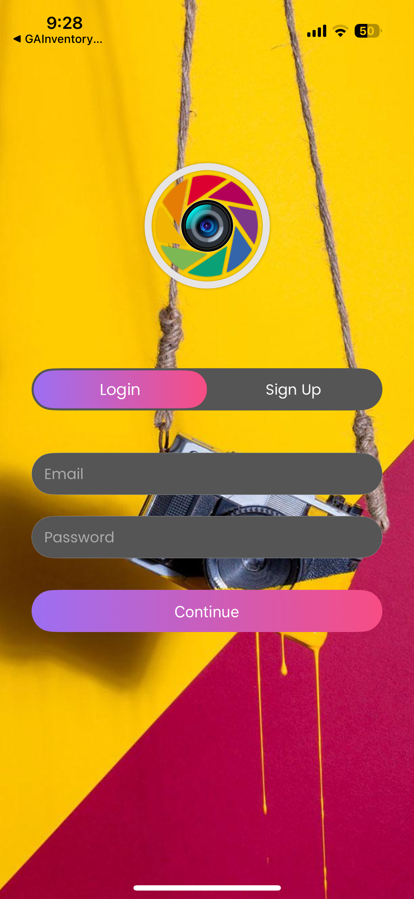
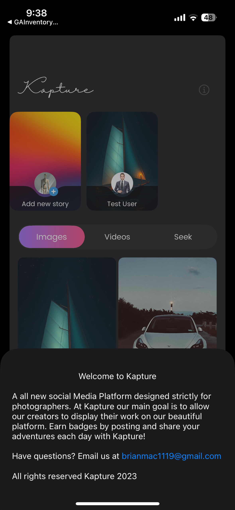
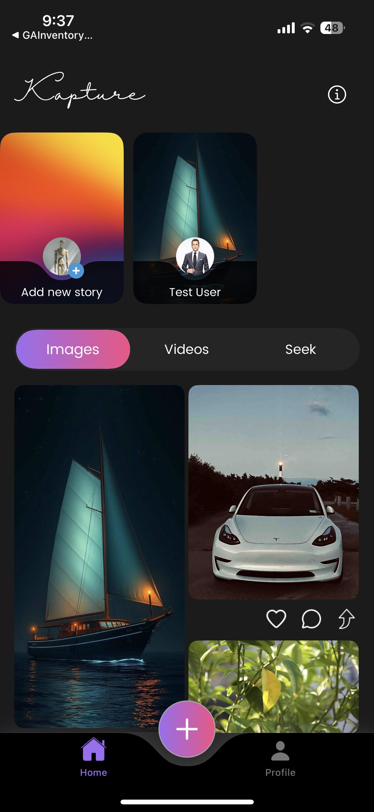
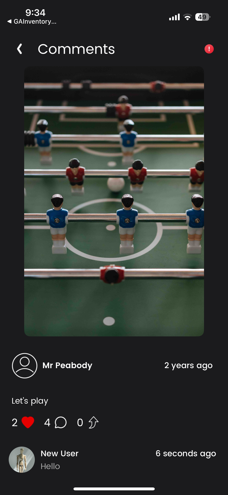
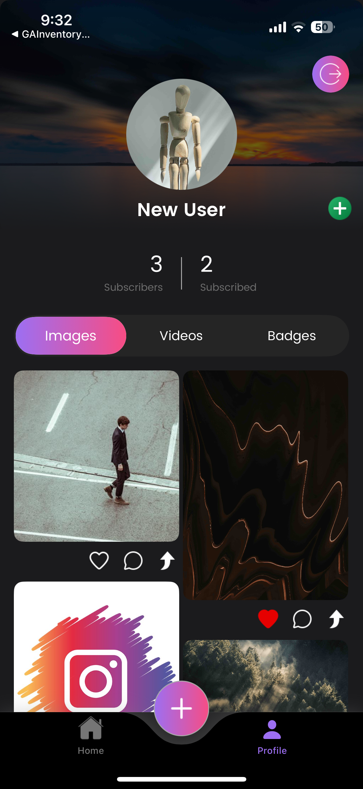

# Kapture 📸

**A Social Media Platform Designed Strictly for Photographers.**

Kapture is an open-source iOS application built specifically for creators to display their work, share adventures, and connect with a community of visual artists. Built entirely using **Swift**, **UIKit**, and **Firebase**, this project serves as a comprehensive example of a full-stack social media app.

<p align="center">
  
</p>

## 🚀 Features

* **Secure Authentication:** Full Login and Sign-Up flow including email/password handling (Firebase Auth).
* **Dynamic Home Feed:** A beautiful masonry/grid layout to browse photography from the community.
* **Media Support:**
    * **Images:** High-quality photo rendering.
    * **Videos:** Integrated video playback support.
* **Stories System:** Instagram-style stories at the top of the feed for quick updates.
* **Social Interactions:**
    * **Like, Comment, and Share functionality.**
    * **Follow/Unfollow system (Subscribers/Subscribed).**
* **Gamification:** Earn **Badges** by posting content and engaging with the community.
* **UserProfile:** Dedicated profile tabs for Images, Videos, and earned Badges.
* **Modern UI:** Built with a sleek Dark Mode aesthetic using standard UIKit components.

## 🛠 Tech Stack

* **Language:** Swift 5.0+
* **UI Framework:** UIKit (Programmatic & Storyboard)
* **Backend:** Firebase (Google)
    * **Authentication:** User management.
    * **Firestore:** Real-time database for posts, comments, and user data.
    * **Storage:** Hosting for user-uploaded images and videos.

## 📱 Screenshots

### Authentication & Onboarding
<p float="left">
  
   
  
</p>

### Feed & Interactions
<p float="left">
  
  
  
</p>

### Profile & Video Support
<p float="left">
  
  
  
</p>

## 💻 Installation & Setup

To run this project locally, you will need to configure Firebase.

1.  **Clone the repository**
    ```bash
    git clone [https://github.com/imhamza32/Kapture.git](https://github.com/imhamza32/Kapture.git)
    cd Kapture
    ```

2.  **Install Dependencies**
    *(If you are using CocoaPods)*
    ```bash
    pod install
    open Kapture.xcworkspace
    ```
    *(If using Swift Package Manager, Xcode should resolve dependencies automatically)*

3.  **Firebase Setup (Crucial Step)**
    * Go to the [Firebase Console](https://console.firebase.google.com/).
    * Create a new project.
    * Add an iOS App to the project using the Bundle ID found in the Xcode project.
    * Download the `GoogleService-Info.plist` file.
    * **Drag and drop** the `GoogleService-Info.plist` into the root of your Xcode project folder.
    * Enable **Authentication** (Email/Password) and **Firestore Database** in the Firebase Console.

4.  **Run the App**
    * Select your simulator or physical device and press `Cmd + R`.

## 🤝 Contributing

Contributions are what make the open-source community such an amazing place to learn, inspire, and create. Any contributions you make are **greatly appreciated**.

1.  Fork the Project
2.  Create your Feature Branch (`git checkout -b feature/AmazingFeature`)
3.  Commit your Changes (`git commit -m 'Add some AmazingFeature'`)
4.  Push to the Branch (`git push origin feature/AmazingFeature`)
5.  Open a Pull Request

## 📄 License

Distributed under the MIT License. See `LICENSE` for more information.

## 📧 Contact

Project Link: [https://github.com/imhamza32/Kapture](https://github.com/imhamza32/Kapture)
